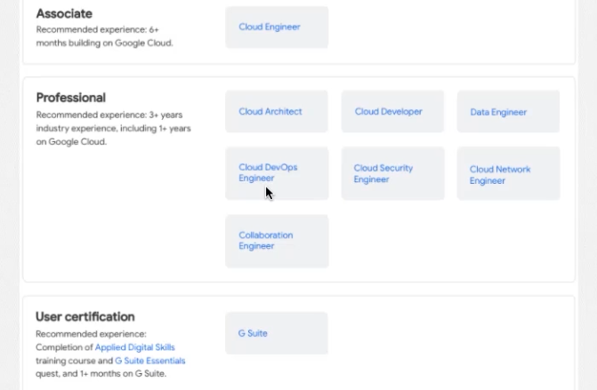
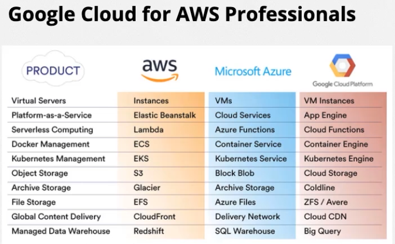
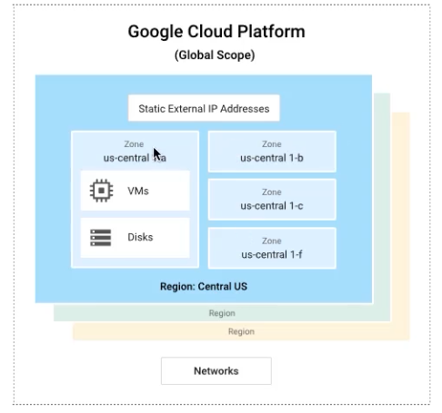

# GCP

GCP é um conjunto de serviços de computação em nuvem oferecido pelo Google. Ele permite que desenvolvedores e empresas criem, hospedem e escalem aplicações, além de armazenar e processar grandes volumes de dados, utilizando a mesma infraestrutura global usada pelo próprio Google.

## Certificações

As duas certificações GCP voltadas para profissionais cloud

## Serviços GCP

A baixo um breve overview comparativo de serviços google e como serviços equivalentes são nomeados em outras clouds, AWS e Azure.

## Escopo: Global, regional e zonas

## Projetos

No Google os recursos são organizados por projetos. 
Ex: 
Projeto1
VM Instances, Google Storage, Rede, configurações,etc.

Porjeto 2 
VM Instances, Google Storage, Rede, configurações,etc.

**Os recrusos do PROJETO1 pertencem apenas a ele**

### Estrutura de identificação básica de um projeto
* Nome: O administrador informa esse dado;
* ID: O Google Cloud prove esse dado;
* Número do projeto: O Google Cloud prove esse dado.

## Como interagir com os recursos?

* Google Cloud Console - Recurso instalado na maquina do administrador
* Command-line Interface (gcloud) - Dentro da página web do Gcloud
* Client Libraries - Bibliotecas disponiveis em diversas linguagens: Python, GO, Java Script, etc.

## Custos

**Calculator:** Define a quantidade de recursos e recebe uma estimativa de quanto será gasto. 

**Link de referencia:** https://cloud.google.com/products/calculator?hl=pt_br

**Pricing list:** Te traz toda a documentação de como os custos são calculados

**Link de referencia:** https://cloud.google.com/pricing/list?hl=pt_br

